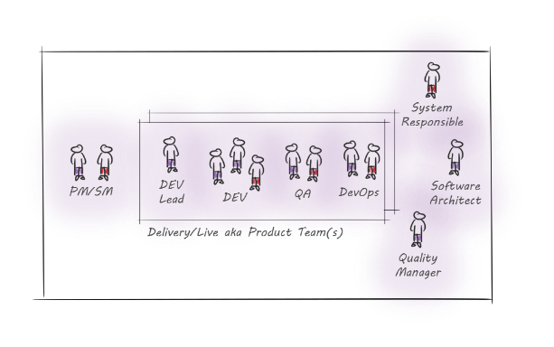

# {{page.title}}

ADM phases

The Live phase of the application (the final phase in the ADM*), or better the moment in time when the actual users start using the application, is the point in the development lifecycle when the Customer gets a return on his investment. It is a live or die situation – the stability and the performance of the application in production can either guarantee your Customer’s success or otherwise lead to his failure. This is the main reason why considering as early as possible the collaboration between delivery and operations should be your point of attention already in the Discovery phase.
In happy circumstances, the future members of the Operations team are involved first in the bid process (during Discovery phase) – like the Service Manager, the DevOps engineer as early as the Alpha phase (when the environments and CI/CD** get set up). Latest, these team members should get involved by the mid of Beta phase (or in other words Development or Delivery phase), in order to set up proper tools and processes to support Release Management, preventive maintenance as well as Incident Management.
As the application approaches the Live phase, the team undergoes a shift in focus and setup. A Service Manager and a DevOps engineer get added to the team, and Developer and Quality Manager undergo a slight change of the mindset – their primary focus isn’t only delivering new features but also ensuring that the existing ones are performing in production and satisfying user needs.
In our projects we use three Live team*** setups and cover a scenario specific to the agile development frameworks – the delivery of the new features goes in parallel to the operations in production. Also, as the change always brings challenges, and such change in our case impacts mostly the Developer role, our scenarios are named after him. 

FIXED DEVELOPER

 
The first scenario we considered is ‘Fixed Developer’, a situation where there is a clear distinction between the delivery and Live teams and the Live team has a fixed developer assigned that deals only with Operations topics (Event Management, Incident Handling, performance enhancements etc.). The benefit of such an approach is that there is no capacity impact to the development, and there is a dedicated person to respond to the operations demands. The main con is the knowledge transfer from Delivery to Fixed Developer that needs to follow each new feature implemented into production. An additional downside is no full allocation to the Live team (in most cases it works like this) – the team cannot assure that the SLAs are always followed, and the constant project and context switching by the developer can cause a knowledge disperse. Considered the above, we came to the conclusion that this scenario is fit only for such setups where there is no more ongoing development.

ROTATING DEVELOPER

 
The ‘Rotating Developer’ scenario as a Live team setup is a situation where developers change ‘hats’ and temporarily (for a week or some weeks) join the Live team to be in charge of the operations topics that require development. The benefits of this approach are multiple – the knowledge transfer is rather lean, as each rotation brings knowledge from operations to Delivery and vice versa, and short rotations enable speedy knowledge spreading within the project. The developer stays fully allocated to the project, and his capacity is shared between Delivery and AMS. A great pro of this approach is definitely the ‘eat your own dog food’ moment, as the developers have a chance to maintain the code they have written. This effect often leads to better software and better software quality. The downside of the ‘RD’ scenario is that the developers cannot be fully assigned to backlog work. An additional point to consider is definitely the knowledge needs – the developer in the RD role needs to have a broad understanding of the system and technologies involved for the application. These are the main reasons we would not recommend this approach for applications with a wide spectrum of technologies (.Net, Mobile etc.). Also, this approach is good for customers who are strict in terms of delivery dates.

ONE TEAM

 
The ‘One team’ scenario integrates some of the RD scenario benefits – it counts on the whole team being responsible for the application, both for delivery and maintenance. As the team has a shared goal, it ensures a true team spirit. With the team working as one the work gets distributed as it arrives – if an incident occurs in production, the team member with most experience or most available capacity at the given moment takes it over, and if needed with support from the rest of the team brings the issue to conclusion. The knowledge transfer in this case is lean – it is part of the overall project and team work. The team is fully allocated to the project, which means no context switching. A drastic increase of the software quality has been noted, as team members’ goals are the same. Even though this might seam as an ideal situation, there are also some downsides. The capacity impact on the Delivery needs to be considered, even though it is not that high as with other team setups, as well as velocity impact – if there are multiple incidents going on during multiple sprints, the team will reserve capacity to deal with them, subtracting it from the Delivery. This team setup is best applied in situations where the Customer has balanced interest in delivering new features and keeping the production stable.
The three Live team setups are a product of our learnings and it represents an evolution path – starting from Fixed Developer as a logical and simplest setup and arriving to One Team as a logical conclusion – the project team is one, as the overall goal should be one. We are a part of the project to ensure the success of our Customer in all areas that are in our responsibility.

*Agile Delivery Method has been a point of reference in Zuehlke for some years now. It has been developed based on the need to have a project structure, on top of agile practices, in order to foster communication and learning across projects. It covers the whole product lifecycle. ADM has been initially based on UK government’s (GDS) lifecycle model and later enriched with roles and ownerships that suit customer-supplier relationship in Zuehlke (cit. Alex Boegli). For the explanation of phases, please see P.1 – ADM phases.

**CI/CD – Continuous Integration/Continuous Deployment chain – tooling that supports deployment and testing of the code changes

***Live or AMS team will support the application once it is productive. AMS – Application Maintenance Services – activities needed to handle and prevent incidents, manage releases and other important tasks related to the production environment. 

*By {{page.authorName}}*
