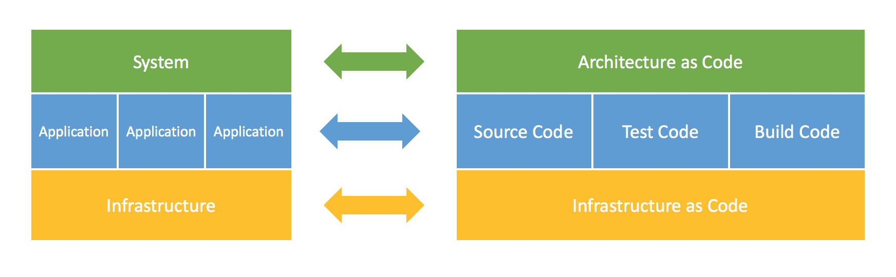

# {{page.title}}

Architectural Programming (APRG) is a programming discipline for architectural elements and structures such as services, data sinks and sources or communication channels. It abstracts from infrastructure elements and hence is distinct from infrastructure as code. The approach requires APIs for architectural elements in order to create and evolve an architecture model using code. Azure, Google and AWS, for instance, all provide such APIs with services ranging from IaaS, CaaS to PaaS.

With the first implementation of the APRG approach, we extended Structurizr, an executable Architectural Description Language (ADL), with an explicit and coded relationship to the cloud infrastructure that is actually needed to implement and execute the system. This bridges a gap that nowadays still exists in most software development projects, a gap between models and code.

The coded model is the very basis for an envisioned overall development workflow that allows the validation of architectural decisions by executable quality attribute scenarios similar to the validation of acceptance criteria by automated functional tests. By expressing the model as code, compliance with quality attributes such as "all storage services are only available from virtual networks" can be tested.

## Architecture models in the product lifecycle
Architecture modelling takes user and business requirements into account in order to provide a guiding structure and enable decisions regarding the implementation and operation of a system, which is ultimately delivered as a product to the customer.

Such a model comprises at least the following:

- system architecture for tiers, infrastructure and connectors between tiers
- application architecture(s) as a grey-box view of the different parts of the system architecture. This view details components and connectors between components 
- quality attribute requirements specifying the qualities required from the resulting system
- architectural decisions as a record of options available and explicit decisions needed to fulfil the given requirements

In the following we consider mainly the system and application architectures. An extension of the approach to requirements and decisions requires further research beyond that which we have implemented so far (see resources: [Structurizr.InfrastructureAsCode]).

## Architectural erosion and the model-code gap
Architectural erosion is the divergence of the architecture model from the source code and infrastructure that actually implements the model. It results in a model-code gap and usually happens gradually during the iterative and incremental development and maintenance of a system. The code and infrastructure evolves, but the architecture model is not kept in sync. After a while, we end up with a model that describes the system as it was meant to be in the beginning but not as it is actually implemented and delivered. 

Such a system is often called "historically grown". It is difficult to maintain and to evolve, since decisions are often implicit, based on local knowledge, and no longer comprehensible once some time has passed. Fulfilment of the quality attribute requirements becomes harder and harder to achieve.

## Towards Architecture as Code 
Our approach is one step towards closing the model-code gap. It combines Architecture as Code with APIs for Infrastructure within the same code base. As an example, consider the following architecture of an Internet of Things solution built to monitor a factory producing stuffed animals:

The frontend tier initially integrates directly with the event store, which is an Azure blob storage solution. After some development iterations it is decided to separate the persistence logic and turn it into an event manager component acting as a facade to the event store. An update of the diagram, taking into account this new component, is necessary and if not done leads to architectural erosion. 

Instead of modelling the architecture in a diagram, we may use code like the following:

Now, when this gets executed, the corresponding infrastructure and connectors are created and the system is ready to be used according to its description in the code.

Note that the implementation is based on Structurizr, an executable ADL which also allows architectural diagrams to be generated. Therefore, we may additionally generate up-to-date views of our current models, as needed, in the system's Architecture Guidebook, for instance.

In case we need to evolve or refactor the architecture, we work directly with the code. Only by this means are we able to modify the actual system and hence the model is always in sync with the code and infrastructure. Of course we could also change the system directly, but this is similar to changing code in a running system without updating the underlying source code in the repository, an anti-pattern which is hopefully nowadays no longer practised anywhere. 

Finally, code can be executed and tested. If architectural requirements are implemented as tests, the architecture can be deployed to a dedicated environment and then the tests executed in a similar manner to functional acceptance testing. If we change the architecture in the next iteration the tests may fail, indicating the incompatibility of the architectural change with the existing quality attribute requirements.

## Conclusion and outlook

The idea of Architecture as Code provides a required abstraction to Infrastructure as Code. With tools like Structurizr and its extension we move further towards executable ADLs which not only describe but actually *implement* the architecture of a system.

*By {{page.authorName}}*


