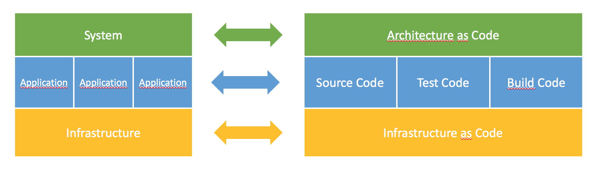
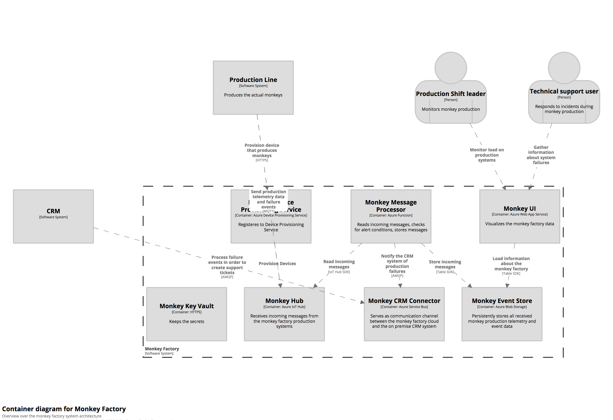
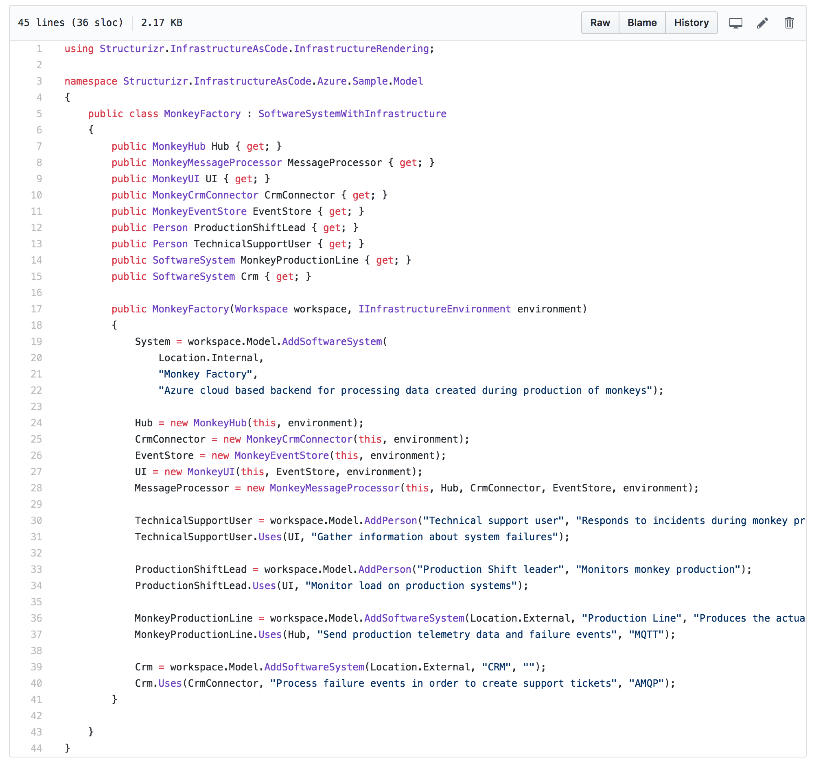

# {{page.title}}

Architectural Programming (APRG) is a programming discipline for architectural elements and structures like services, data sinks and sources, communication channels. With this scope it abstracts from infrastructure and marks a distinction to infrastructure as code. The approach requires APIs for architectural elements to create and evolve an architecture model using code. For instance Azure, Google or AWS all provide such APIs with services ranging from IaaS, CaaS to PaaS.

With the first implementation of the APRG approach we extended Structurizr, an executable Architectural Description Language (ADL), with an explicit and coded relation to the cloud infrastructure that is actually needed to implement and execute the system. This bridges a gap that nowadays still exist in most software development projects, a gap between models and code.

The coded model is the very basis for an envisioned overall development workflow that allows the validation of architectural decisions by executable quality attribute scenarios similar to the validation of acceptance criteria by automated functional tests. 

## Architecture Models in the Product Lifecycle
Architecture modeling takes user and business requirements into account to provide a guiding structure and decisions for implementation and operation of a system, ultimately delivered as a product to the customer.

Such a model comprises at least

- System Architecture for tiers, infrastructure and connectors between tiers
- Application Architecture(s) as a grey-box view of the different parts of the system architecture. This view details components and connectors between components 
- Quality Attribute Requirements specifying the qualities required from the resulting system
- Architectural Decisions as a record of options and explicit decisions to fulfil the given requirements

## Architectural Erosion and the Model-Code Gap
Architectural erosion is the divergence of the architecture model from the source code and infrastructure that actually implements the model. It results in a model-code gap and usually happens stepwise during iterative and incremental development and maintenance of a system. The code and infrastructure evolves, but the architecture model is not kept in sync. After some time we end up with a model that describes the system as it was meant in the beginning but not as it is actually implemented and delivered. 

Such a system is often called "historically grown". It is difficult to maintain and to evolve further since decisions are often implicit, based on local knowledge and are not comprehendable after some time any more. Fulfilment of quality attribute requirements is getting harder and harder to achieve.

## Towards Architecture as Code 
Our approach is one step towards closing the model-code gap. It combines Architecture as Code with APIs for Infrastructure within the same code base. As an example consider the following simplified architecture of a software steering a monkey factory:

The frontend tier initially integrates directly with the event store, which is a Azure blob storage. After some development iterations it is decided to separate the persistence logic into an event manager component acting as a facade to the event store. An update of the diagram according to this new component is necessary and if not done leads to architectural erosion. 

Instead of modelling the architecture in a diagram we may use code like the following:

Now, when this gets executed the corresponding infrastructure and connectors are created and the system is ready to be used according to its description in the code.

Note that the implementation is based on Structurizr, an executable ADL which also allows to generate architectural diagrams. Therefore we may additionally generate up-to-date views of our current models as needed in the system's Architecture Guidebook, for instance.

In case we need to evolve or refactor the architecture we must work directly with the code. Only by this means we are able to modify the actual system and hence the model is always in sync with code and infrastructure. Of course we could also change the system directly, but this is similar to changing something in a running system without modifying the underlying source code in the repository. 

*By {{page.authorName}}*


