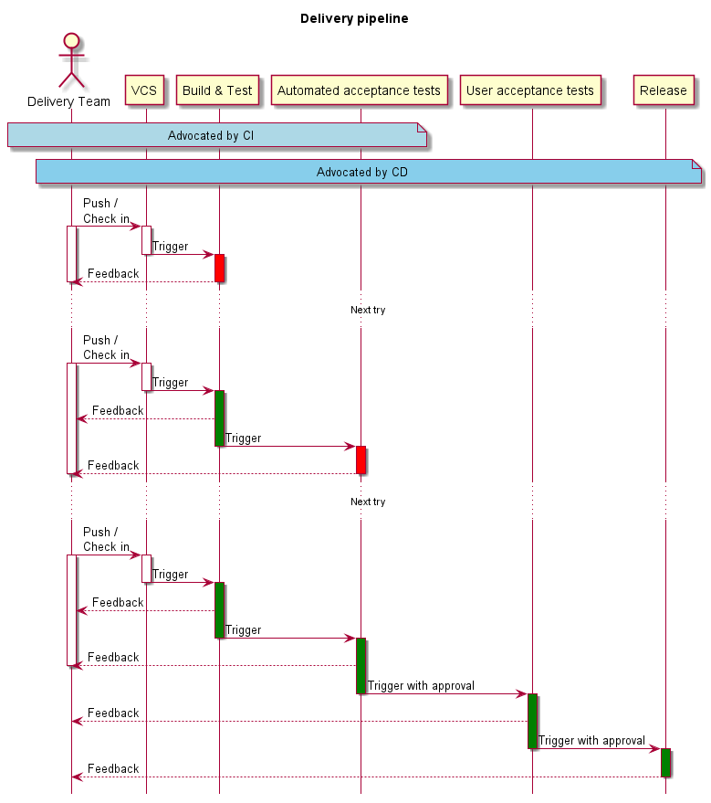

# {{page.title}}

## Short introduction and history of CI

Continuous integration (CI) was adopted and driven by the extreme programming (XP) methodology in order to combat _integration hell_. XP first advocated writing unit tests which every developer can run locally before merging to the main line. In later iterations of XP, the concept of a build server was introduced and further improvements led to what we refer to as CI:
* Fast automated builds
* Run on every commit
* Including tests
* Run by some mechanism that can provide feedback to developers.

## Short introduction to CD

Continuous delivery (CD) builds upon CI with the aim that the mainline branch can be released and deployed to production at any time. Continuous delivery is quite similar to continuous deployment but continuous deployment will deploy any merges to mainline to production (if tests pass), whereas with continuous delivery, releases and deployments are triggered by a human. For an example see below:

The pipeline follows the *fail fast* approach, delivering quick feedback and ensuring target systems remain in an acceptable state if tests fail.

## How to do it right

There is no _one way_ to do CI/CD right. The same way you can't have a _right_ way to do Scrum or XP.

There are a number of obstacles to overcome on your road to CI and CD. Obstacles you must overcome can be categorised as:
1. People
2. Organisations
3. Tooling

## Issues around people

### Inexperienced developers

They tend to write code that is not designed for testability, resulting in 
* fewer tests, which then results in bad quality and an increasing chance for a bug to sneak into production. This can torpedo CI/CD because people advocate "taking more time" to fix issues. It is important to remember that CI/CD can give you the same quality _faster_. Your best approach will be to coach or lead by example on how the issue could have been fixed without sacrificing speed. Your success depends on how much the team believes in CI/CD.
* Tests using a lot of mocks tend to be more fragile. Fragile tests directly hinder integration because tests have to be fixed. Here, your best bet is enabling developers to design better code so they can get rid of fragile tests altogether. It is imperative that you act early because once this issue escalates, CI/CD will be seen as a constant pain.
* Slow/flaky tests with a difficult setup on a higher unit than necessary. Your delivery pipeline slows down and must be fixed by demonstrating better software design to your team.

### Large product backlog items

Large product backlog items (PBI) or big impact changes created by inexperienced requirements engineers are the enemies of quick integration if they must be integrated as a whole. Inexperienced developers may be tempted to defer integration until "their" PBI is done, leading to integration hell as by then a sizeable piece of the codebase will have been changed.

### Scepticism
A lot of people are sceptical until they experience the benefits. The best way is to focus on a small set of pain points and to address them transparently. There may be people that object to the idea of having a faster integration cycle fundamentally; if their beliefs are motivated by personal reasons then you may need to restructure your team. Examples are:
* Clinging to manual tests out of fear of losing control
* Weak confidence (without explanation) if build is green
* Taking pride in a "build master", that is a human quality gate through which all code must pass

## Organisational issues

* Increase in pressure: An organisation may redirect its resources away from CI/CD. Prepare stakeholder buy-in before starting CI/CD, be transparent and point to buy-in throughout implementation. There is no shame in failing transparently.
* Unsuitable process: There may be other processes conflicting with the goals you want to achieve. Get management buy-in beforehand and pick which processes to challenge; you will lose some battles to win the war.
* Unsuitable infrastructure: It may be very difficult to realise CI/CD with the current infrastructure. This is something you should check before starting and raise as a precondition. Explore different infrastructure providers by going to the cloud, or request new hardware.
* Code review ping-pong: Asynchronous code reviews take longer and require more task switches. Try out face-to-face reviews or pair programming.

## Tooling issues

* Slow regression feedback: You may experience slow feedback due to hardware constraints. The first solution is to pay for better hardware (which is cheaper than humans). Otherwise see "Slow/flaky tests" above.
* High-noise feedback: The feedback from your pipeline can overwhelm people, and they will ignore feedback altogether. Make sure you only send feedback in cases where human intervention is required.
* Long integration queue: If you see a build server being overloaded with requests, get more servers/scale out in the cloud.

**Solving obstacles around people is both the hardest and most important challenge you must overcome, while tooling is the easiest and least important.**
A successful CI/CD pipeline will make you and your team more productive and will increase quality.

*By {{page.authorName}}*

