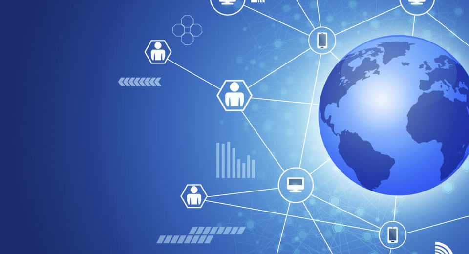

# {{page.title}}

### Is it an outsourcing?! Is it a team sourcing?! No! It is the Distributed development!

Dive into Distributed development topic and get all the information needed to kick off the project in Distributed Development setup.

### 1. What is it?
Distributed development is a powerfull way to realise project research, development and realization across two or more physical locations. Difference between outsourcing and distributed development is that, in DD setup, all the organization is working together on same level with common goal of project realization. In Zuhlke Group, Distributed Development is a tool, a process and a culture.

### 2. How does it work?
In the DD setup there are mutliple team members that are distributed to at least two or more locations. In most cases the team is distributed between two locations.
It ususal that team has a colocated project kick off, where all team members have oportunity to meet each other in person, meet their Clients, their stakeholder and get direct contact with all the key memebers of the project.

Common language for comunication is English, for daily communication, meetings, documentation and relevant project resources.

Transparency in the team is one of the most important aspects and key element of one team feel. All team members should share ideas, experience, information, resources and desicions.

Team collaboration is internet based which means that it uses online tools for daily work such as skype, email, jira, slack, whiteboard, retrium, trello etc.

Organizational tools that are also present in this setup are remote and colocated pair programming and knowledge sharing sessions. It helps to build the team's knowledge base stronger and boost up their confedence and mutual trust to perform as one team.

### 3. What are the main benefits?
**Scalability** of the team is close to limitless since it is not dependent on one location. **Finding skilled team memebers** as best expert for the job **is easier** in DD setup since it creates an access to larger skilled team members pool. On other hand it helps to **keep close proximity to the Market and the Customer**. **Cost benefits** are positively affected since it allows project to hire team members from other locations with **lower rates** but keeping the **same qualitity** of and desired expertise level.
DD with its distributed locations **increases competitiveness on global market** and allowing companies to fulfill growing market interest. Companies have oportunity to **meet new people** and travel and **exercise knowledge sharing** through whole organization.
It also decouples employees and their work from phisical location which means **no location boundaries**. They can do home office or any office (across the whole organization).
Since DD setup is vendor's internal organization process there is **no overhead for Customer**.

### 4. What are the challenges and how to overcome them?
##### Language barrier - bilingual
English as common language of communication is on of the best practices for Distributed development setup. But since it covers global market, most common challenge is language barrier. This is mostly coming form Customer side which is understandable and realistic. Simply there are no exclusive conditions that all of the business representetives should know to speak English. This can be solved by using bilingual apporach for all shared resources, ad better plan and facilitate meetings where there are participants that use different language for communication.

##### Different time zones - collocated kick offs and time management
DD setup can also work with different time zones. Collocated project kick off helps to get the all team memebers to meet each other better and to generate one team feel. Also at the kick off time plannning and management is important so the team can use the time overalaps in bet possible way as the project progresses.

##### On-sight support - proxy
Projects usually provide production and on-sight support for Customers. This could have limitations if the team is disrtibuted on locations further from the Customer or even in other countries and also from legal perspective. This is solved by introducing proxy roles on the side of the team which is closest to the Customer. Proxy role allows the whole team to be involved and contribute to the production support on their project.

##### Cultural differences - collocated kick off and regular visits
If the team is distributed between different countries it is important that they are aware and understand cultural differences. By doing colocated project kick off and having bidirectional regural visits, team members can learn about each other, get to know the culutral differences and by understanding them communicate and perform better as one team.

##### Inital mindset/one team feel - collocated kick off, regular visits, distributed sessions and coffee breaks
Initial mindset of one team can be challenging to achive. It is a key to a very succesfull distributed team. This mindset can be achived with collocated project kick off, having regular bidirectional visits, organizing distributed sessions for knowledge share, pair programming, planning, desicion making. Also a powerfull tool are informal distributed sessions such as distributed coffee break. Yes, it's simple as that: grab a coffee or your beverage of choice, join the group meeting, turn on camera and have fun - talk about anything you want with your team members :)

### 5. What can you distribute?
Almost any role that doesn't require close proximity to the customer can be distributed. We had exeprience of distributing roles such as PO, Scrum master, meeting facilitator, software engineer, QA, SD, UX, DevOPS, PM, Agile coaches and many more. Educate and encourage Customer to use distributed setup.

### 6. What setup do you need for it?
Internet of course and people :)
Infrastructure is important aspect that needs to be setled by having dedicated rooms/places for video conference, good headsets and other video and audio equipment. If properly set, each of your team mate is on a click of a button away.
Team spirit and motivation is develop as the project progresses but there is nothing better to kick start this then a proper colocated project kick off and a good new memebers omboarding plan. Online tools and their preparation (accounts, spaces, licences etc.) is also important to be setup in earliest phase as possible.

**_After all said and done, if well prepared with the guidelines from above Distributed Development can be a very powerfull asset to the company and a very fun adn efficent way to do projects._**

*By {{page.authorName}}*


