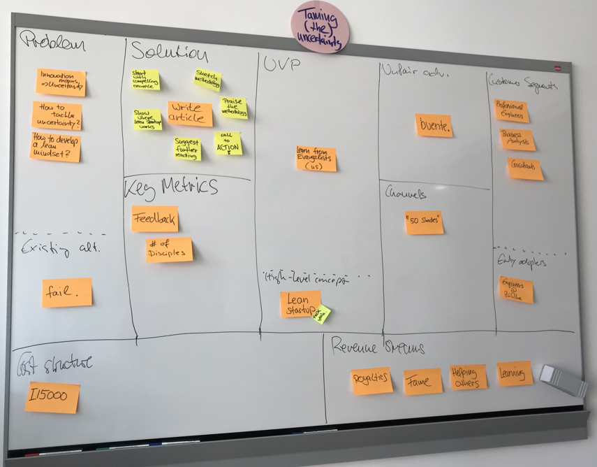

# {{page.title}}

Have you ever been in a project with an unclear vision? Maybe a project where the stakeholders disagree about who the product's main users will be? Or a project with a long list of "must-have" features but no agreement on how to prioritize them? 

The next time this happens, try the Lean Startup methodology to tame your project's uncertainty. Some of its the principles are:

* treat everything you believe as an assumption that needs to be tested
* build the smallest possible product increments and use them to get market feedback
* build up your knowledge through many quick iterations of the build-measure-learn cycle
* fail early and then change course based on what you have learned.

Classic examples: 

* Zappos. Started not by creating a web-shop for shoes, but by taking photos of shoes in retail stores and putting them on a static web site. The founder processed orders by hand. Goal: learning what customers want from an online shoe retailer.
* You consider to create a newsletter. Instead of hiring a newsletter team, just add a sign-up-form on your web site. Define beforehand how many sign-ups you want before you actually start producing the newsletter.

“Yeah, nice!” you say. “It’s for start-up founders, just as I expected from the name. *So why should I use this method in my development or consulting project?*”

Here’s why:

All projects have to cope with uncertainty. It’s highest at the outset, but it never goes away. That’s why we employ agile methods. Lean Startup is useful because it helps you decide what to do next under conditions of uncertainty: everything is an assumption until you validate it. Find the assumption that carries the biggest risk for your project, then look for the simplest experiment to prove or disprove it.

Do you understand the business model of the product or service you are helping to build? Who are its customers? Which of the customers’ problems will the product solve? What is its Unique Value Proposition and how is it going to be implemented (the solution)? To answer these questions, spend one hour with your team to fill in a Lean Canvas - a one-page business model consisting of nine segments. It requires you to spell out all your assumptions about the product and supports a shared understanding of what you're trying to build.

A Lean Canvas can have additional benefits:

* The customer segments point at personas to look into during UX research. 
* The Unique Value Proposition will make discussions with stakeholders and users more purposeful. 
* The solution can be a starting point for determining the project’s scope and technology. 
* Prioritizing the risks on the canvas might quick-start your risk analysis. 

With the Lean Canvas filled out, a first shot at the business model is right in front of you. Now tackle the uncertainty by conducting experiments that challenge the assumptions that carry the biggest risk. Typically, those are the customer segments and the problem to be solved. Two very simple experiments are problem and solution interviews as described by Ash Maurya in “Running Lean”. Use them to derive a deep understanding of your customers’ problems and to design and validate a solution that fits their needs.

A problem interview is fairly easy to conduct. Identify some potential customers or “prospects” that are willing to discuss your idea for an hour. Tell your prospect a story that highlights the three most important problems your product or service will attempt to solve. Ask the prospect to rank those problems. Then, ask them how they address each of the problems today. At this point, most people will tell you their story. Just sit back, listen and learn about their world view. To deepen your understanding, ask open-ended follow-up questions, and of course take notes about everything you hear and observe. This procedure will provide you with a wealth of information about your customers’ real needs, thereby reducing the uncertainty in your project. Use the insights to update your Lean Canvas.
If the problems could be validated, quickly create a demo to test with your prospects in a solution interview. The demo should be light-weight, easy to change and look realistic. Demonstrate to your prospects how your solution will address each of the problems validated previously and ask whether they would use it. Again, sit back, listen and learn. If the prospects respond positively to your demo, test your pricing by telling them what the real price will be. 

Performing these steps together with the team does not take much time, but it does a great deal towards taming the uncertainty inherent in your project.

### Further reading

* Eric Ries – The Lean Startup
* Ash Mauria – Running Lean
* Niklas Mådig & Per Åhlström – This is Lean

*By {{page.authorName}}*
