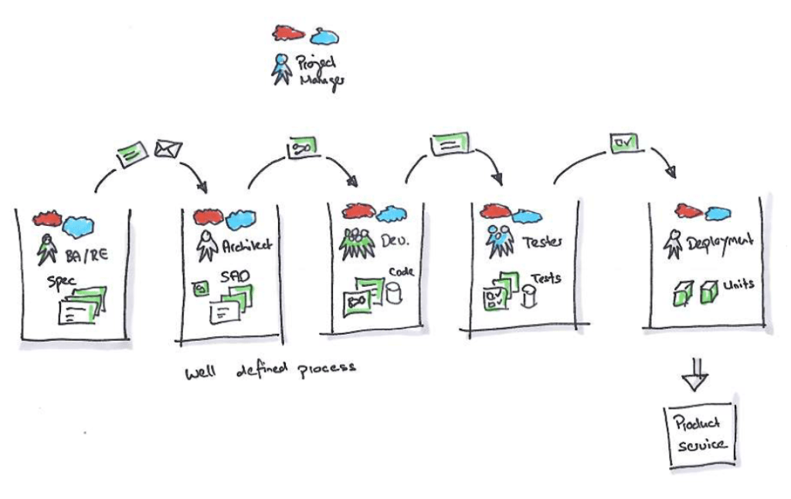

# {{page.title}}

Another article in my 10 Things about Agile Series that I initially presented at the Business Analysis Conference in London. You might know the term farmer wisdom (or Bauernweisheit in German). One of my own is that Silos are for Farmers and not for Projects.

Very often I see a BA team working with clients to get an idea of processes and collect requirements. A huge specification gets created and then transferred to the Architects which then interpret the specification and create a Software Architecture Document that goes along with the Specification. This two document reflect the perfect package for a development team (anywhere in the world) to create the perfect application for the client…

.. there are really people, even companies out there who believe that. I once witnessed a talk on a conference where two such architects presented such an approach and they were booed out by the agile developer crowd.

of course in this perfect world, the devs create code which then gets thrown at the testers and then goes into production. Every team has its own little cloud of problems and knowledge in their little silo.

But as we learned that Information is not Knowledge and wisdom can’t just thrown over the fense and others can pick up on it. Is is much better to actually have to whole team on the same pasture. Have a common understanding of the problems and a common knowledge base. This team can then work together to solve a complex problem. There are indeed documents which might get created. Software Architecture Documents help new joiners to get a quick overview, complex business cases or rules should be written down and test cases certainly are documented as well (mostly as executable elements).

As I already mentioned before, you can’t document knowledge but you have to encourage your team to build up tacit knowledge by working and learning together. Of coures you should try to keep the team stable, whenever you can.

*By {{page.authorName}}*
