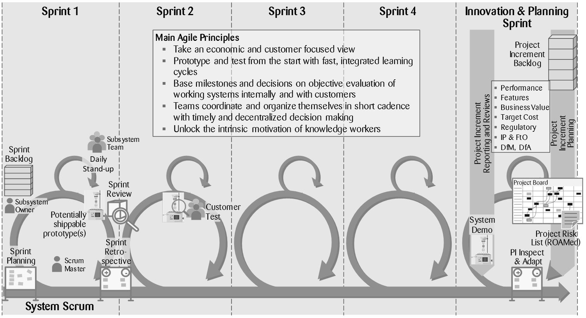

# {{page.title}}

*Lean-agile has swept over and transformed software engineering during the last decade. Despite additional hurdles when implementing lean-agile in the systems and product engineering field, the transformational force and the benefits are comparable. Many companies have started to adopt agile practices outside the software engineering discipline. Most of these are at the beginning or in the midst of the transition. Zühlke has provided consulting services for a leading global manufacturer of laboratory equipment and consumables, with regard to transforming the business units and 10 development competence centres worldwide to allow the advancing of sustainable profitable growth by implementing a lean-agile innovation process. The following article summarises experiences and lessons learned from this agile transition project.*

## At the top management level, agile is a means not a goal

The customer has been very successful in the past two decades in defining quality standards in the industry and growing healthily by pursuing geographic expansion. As is often the case, success brings complacency and in this case insights into the real needs of different customers and the predictability of project outcomes and timelines needed improving. Just making the product 10% more accurate or faster no longer created sufficient customer value. The technical limits of improving product performance had been reached. Breaking through these them made the products excessively expensive and the development effort unpredictable. Agile, with its focus on customer value, early customer feedback cycles and delivering working prototypes with a short cadence promised to be a suitable remedy to many of the weaknesses in the organisation. Launching products that excite customers and users in a regular and predictable tempo was required to secure the future growth and success of the company. When transitioning to agile, we always have to steer the transformation based on such overall goals of our customer.

## To start, organisation beats process: What’s in it for me?

The challenges that were met were as diverse as the scope and size of the various competence centres. Writing software applications, creating complex multi-disciplinary systems and designing plastic components to a precision of a few thousandths of a millimetre are examples of the range of development work performed at each plant. Some R&D competence centres have around a dozen engineers while others employ more than 60 people. At all plants, the R&D teams constitute the technical knowledge centres of the plant and besides developing new products they fight obsolescence in current products, evaluate and commission new production equipment, support production, suppliers and sales and much more. Agile poses different challenges in such a diverse environment. It needs to be carefully worked out what agile means for each team, how it can be implemented and what the path from the current situation to the agile world looks like. Only when each person involved knows their role in the agile process, is he/she ready to discuss the details of the agile procedure and the methods.

## Stepwise adaptation of agile thinking and methods

As the situation regarding customer insights suggests, few of the pilot projects introducing agile at the customer started with an established set of requirements. They started in an explorative agile mode, where developing the requirements, rating customer value and defining a suitable product concept constituted the major scope. However, to start the agile cadence with its cycle of sprints, an initial product backlog was needed. From that, each team worked its own way down to the team/sprint backlog that could drive the first sprints. Now the agile sequence of ceremonies was introduced, and the duties and behaviour of the roles became more refined. After those basics had been adopted, more elaborate practices, such as project increment planning, were introduced and trained. Once the product positioning and conception was finalised, the mode of the project changed to an agile execution, with further refining of requirements and design being conducted in parallel.

## Simplicity, adaptability and acceptance are key

Agile requirements engineering proved to be particularly challenging in the diverse environment at the customer. Generally, the products and systems there exhibit more and wider reaching interdependencies than many software applications. Each engineering discipline had different perceptions regarding how a set of requirements should look like, and which the engineers had to work on during a sprint. Concepts from the software engineering world like features, enabler and stories were not always easy to transfer into the worlds of mechanics and automation. The separation of functional and non-functional requirements provided little additional information or help in designing physical parts. We therefore ended up with two levels of requirements that every team could translate into its own world and work with for planning and realisation:

1.	Product Backlog Item: Defines the characteristics of the product for customers, users, production, logistics and service; owned by the Product Owner and agreed with all relevant stakeholders before implementation; a complete set represents the requirements specification (Lastenheft) of the product.

2.	Team/Sprint Backlog Item: Split and detailed requirements and specifications ready for implementation during a sprint; owned by the Subsystem Owner and agreed with all team members; basis for sprint planning and execution; a complete set represents the technical specification (Pflichtenheft) of the subsystem.

That concept proved to be sufficiently agile to support the agile cadence and adaptable to the needs of e.g. plastics engineering, which necessitates a complete set of requirements before finalising the design and releasing the tool making.

## Collaborative product strategy development is a mixed blessing

Many agile pilot projects were started without an agreed product positioning and vision. Although many engineering and application team members considered it interesting to be involved in such strategic clarification, the ability to contribute differed widely and not everybody could cope with the degree of uncertainty involved. However, management accepted the low efficiency during the exploration period and innovative approaches and product concepts regularly resulted from the collective struggle to find better solutions.

## Estimation, velocity and definition of done remain difficult and critical for efficiency

Besides the boost in motivation that results from the involvement and ownership of team members, the undisturbed estimation and execution of development tasks in a short cadence during a sprint is a main driver for increased performance in agile development. However, gauging team velocity, nailing down estimates and committing to the completion of deliverables remained challenging leadership exercises that needed constant attention in a cordial company culture.

## Who is part of the development team? Who works in cadence?

To focus on project development work, we stipulated that each development team member should work at least three full days per week on the project. That was a daring target for an organisation used to working on many projects in parallel. The support of the top management for this helped to make continuous improvements on this subject and to bring distraction down to a bearable, although constantly disputed level. The handling of interfaces to other functions like production, procurement and marketing was also challenging. In traditional project management, those functions are involved as extended team members and their tasks are planned and tracked on a Gantt chart. Fully including the representatives of those functions in the agile cadence of the development team is inefficient. Often, those functions are intensively involved only during a specific period of the project. We had to establish the awareness that organisational interfaces need to be explicitly managed and that there are shades between being “fully inside” and “fully outside” the project. Some organisational interfaces e.g. launch preparation, can run in parallel with the agile cadence of the development team, with their own (launch) team and coordinated by the project increment planning and Scrum-of-Scrum mechanisms. Tool making could be integrated into the development team during the respective sprints. Some interfaces need to be managed specifically by the responsible person. We continue to work on establishing practical guidelines for the differentiated handling of interfaces that might be less agile and rely on clearly specified inputs and outputs.

*By {{page.authorName}}*