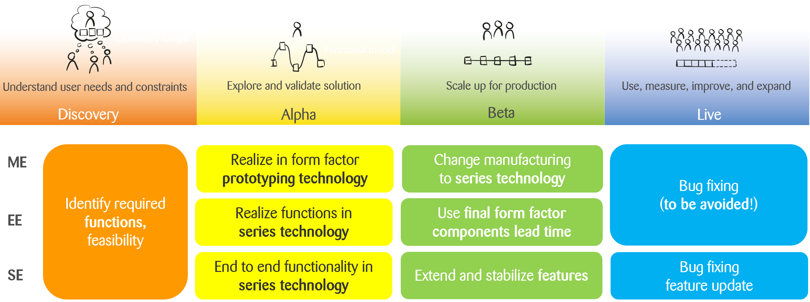

# {{page.title}}

What are your experiences in interdisciplinary development of a product comprising software, electronics and me-chanics? I would like to share the observations I made about interdisciplinary system development!

It seems that developing within just one discipline (engineering software or electronics or mechanics) is usually work-ing quite well. But when these disciplines need to create one product together the challenges arise at the discipline boundaries: on the one hand these boundaries (and to be more precise where these borders are defined concerning which function will be realized in which degree by which discipline) offer the chance for innovations! On the other hand the most common root cause for project issues is ineffective communication at these borders!

Interdisciplinary projects require outstanding attention at discipline interfaces: Primarily on human communication!

But being aware of these boundaries is not enough. The working mode between the disciplines is just very different because the constrictions are very different. Some examples for a device development comprising software, elec-tronics, mechanics are (see figure 1):

* Mechanical components and assemblies usually start in the final form factor and will be detailed subsequently. Go-ing from the concept phase (alpha) to series development (beta) usually means a change of manufacturing tech-nology (e.g. from additive manufacturing to plastics injection molding).

* Electronic circuits are usually realized in or close to series technology even in concept phase (alpha). The final form factor is usually considered only at series development (beta).

* Software usually provides end to end functionality at the concept phase (alpha), maybe even with mock ups. These existing features are extended and stabilized during the series development phase (beta).

Figure 1: Comparison of main drivers per discipline during product development lifecycle

The next interesting aspect as communication pitfalls are ambiguous terms! Are you sure you are talking the same language with your colleagues? Check out some exemplary terms (the term “HW” is used in the meaning electrical and mechanical engineering):

* “Iteration”
  * HW: related to maturity, not cadence
  * SW: cadence or repetition
  * Proposal: use “sprint” instead of “iteration”

* “Prototype”
  * HW: typically a sample for verification (close to launch date of product)
  * SW: e.g. UX-prototype, proof of concept, throw away prototype (at the very beginning of development)
  * Proposal: use a specific prototype like “verification prototype”, “UX-prototype”, “throw away prototype” 

* “Design”
  * HW, SW: Meaning of aesthetic design
  * HW, SW: construction, plan for building

* “Increment”
  * HW: typically an HW-“increment” is meant as next level of maturity
  * SW: per definition each increment takes one sprint

* “Subsystem”
  * HW: logical meaning (like description of structure)
  * SW: logical or implementation unit

* “Integration”
  * Meant functional (HW, SW) or spatial (HW)?
  * On component (HW, SW) or on system level (HW, SW)?

Talking about communication also requires thinking about the different types of meetings and an effective culture: pay attention to whether the right people talk about the right topics, e.g.

* Standup
  * It is your responsibility that everyone attending understands the (high-level) information you provide including limitations of your knowledge.
  * Set the stage for your information: Give a context (one or two sentences)
  * Provide specific information about the context
  * Explain possible the consequences
  * What are you planning to do concerning this topic
  * For explaining a discipline-specific term it is helpful to have a term of the week slot after the standup. Make sure to also document the term in the project glossary.

* Technical sync
  * Use a regular technical sync, e.g. weekly, for planning the big picture and details of the integration strategy

* Discuss topics affected by more than one discipline, make the unknown visible!
  * Document and communicate your integration plan (e.g. by using the maturity table described below) 
  * Include in this planning also the use of rapid prototyping means (EE, ME) for early integrations and physical samples
  * These samples provide insights and value!
  * Use a continuous integration environment for the system to ensure robust artefacts where the new unit can be integrated into
  * Reconsider learnings and assumptions at decisions
  *  Further chances to avoid conflicts during project lifetime are to identify internal requirements like
  * Interfaces for bring up
  * development driven interdisciplinary tasks
  * Consider some efforts for interdisciplinary support for bug fixing

There is a central communication tool addressing the needs mentioned above: we call it “maturity table”. This tool is a simple but very effective table describing the integration strategy with its steps and associated samples. It develops during project lifetime and needs to be updated regularly. Typically, each insight to be generated (or realized device sample) is described by one column, each subsystem in one row with its required functionality and maturity (figure 2).
 

Figure 2: Maturity table as central communication tool describing each integration sample (simplified example)

This table is very valuable for discussions between the project team and the sponsor as well. Based on functions and subsystems it allows you to trigger the necessary discussions to avoid surprises during device development.
My three most important take aways for you are:

1.	The more disciplines are affected of a system, the more sprints are necessary to generate a common under-standing of the system and the neighbored discipline. Usually this is mission critical.

2.	Use a systematic approach to ensure the right people are talking about the right topics (e.g. an adapted meeting culture and the maturity table).

3.	Don’t assume anything, especially about other disciplines – just talk!

*By {{page.authorName}}*