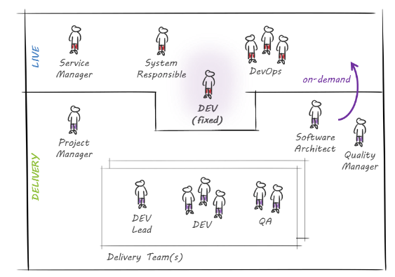

# {{page.title}}

Every software development project approaches go-live readiness at some point during the software development and enters the live phase. Actual end users start benefiting from implemented features and the sponsor gets the return on their investment. However, the phase before and after go-live can be intense. Aspects around the operational readiness, as well as organizational and procedural considerations regarding future support and operations are then at the heart of discussions. 

There are many supporting factors that can lead to a project's success in this phase. One key good practice from our projects is to involve colleagues with experience in support and operations early on in the process. A service manager can provide valuable input during the bid phase in terms of release and incident management. And a DevOps Engineer can set up a CI/CD pipeline at the start. Such measures ensure a smooth, high-quality release to production. 

However, when a software development project approaches the live phase, the team in charge undergoes a shift in focus and setup. In the following, we present a set of collaboration models for teams that are transitioning from initial software delivery to continued delivery with support and operations.

## Fixed developer

 
One or many developers may be exclusively assigned to support and operations activities. The benefit of this approach is that there is no capacity impact for ongoing development - as the fixed developer(s) are not participating in that. Also, it ensures that there is always a responsible team member available to respond to support and operations topics. However, this advantage comes along with a huge downside in terms of knowledge transfer. As the developer is not participating in ongoing development, supporting newly developed features in production can prove a challenge. Consequently, the fixed developer will, in any case, have to approach team members about issues arising in production. This effectively leads to a capacity impact, so the upside of this approach turns out to be questionable in practice. Furthermore, it is usually the case that a developer is not fully allocated to a project in this scenario. Because there are rarely enough incidents to keep an expert busy 24/7, a developer is assigned to multiple projects. This leads to cross-project planning conflicts, in particular when there are incidents to solve at the same time in all of them. Last but not least, this setup leads to an increased amount of context switching and will therefore reduce the overall efficiency of any person in charge. Given these practical implications, our conclusion is that such a scenario only works for projects where there is no ongoing development. 

## Rotating developer

To mitigate the above-mentioned downsides, we experimented with a 'rotating developer' setup. Here, the responsibility for support and operations duties rotates throughout the team. The related advantages here are threefold:
* Between periods of taking their turn for support and operations duties, the developers are participating in ongoing development and therefore possess the knowledge to support incident resolution in production. 
* Developers who fixed issues in production when it was their turn for support and operations duties will tackle the development of new features with a different perspective. The 'eating your own dog food' effect turns out to have a positive impact on quality after a couple of rotations. 
* A developer can be allocated fully to one project, which mitigates the negative effects of the fixed developer approach. 
However, this collaboration model also has its downsides. While taking their turn for support and operations duties, developers cannot be fully assigned to backlog work and, due to the hardly plannable nature of production incidents, it can happen that even the reserved capacity is not sufficient. In addition, this model is a challenge in situations involving a broad spectrum of technologies. That is simply because one single developer is rarely an expert in all areas. But, given a less diverse technology mix, this model is well-suited to projects with strict delivery timelines - as the rotation model introduces appropriate planning means.  

## One Team

The motivation to continuously improve our team setups has led to a third model. It integrates the benefits of former models and attempts to mitigate two remaining downsides. As noted earlier, it is a challenge to take over responsibility for support and operations as a developer in projects where there is a diverse technology mix. Furthermore, despite having established a lean knowledge transfer due to rotations, there is still some overhead involved, e.g. on a handover. We therefore started to experiment with team setups where the whole team is continuously in charge of both ongoing development and support and operations activities - a model therefore referred to as the 'One Team' model. Once an incident comes in, the team decides who is best suited to tackle the issue in terms of knowledge and capacity. Therefore, this model is suited to projects with a diverse technology mix. Furthermore, it significantly increases efficiency because it eliminates the need for handovers and it benefits from having a team that is responsible for achieving a common goal. This team spirit releases supportive behaviours; for instance, even if a specific team member has taken over the task of resolving an incident in production, the remainder of the team will provide more input and support than in a scenario where this responsibility is delegated to a single person. Furthermore, the above-mentioned 'eating your own dog food' effect scales in that situation. A team that is very aware of the challenges of any given software solution in production will take very informed decisions regarding new features. However, this collaboration model also has its downsides. The number of issues to resolve in production impacts the velocity of a team and it can happen that a Sprint goal is jeopardized. Therefore, this setup is best suited to projects in which the priorities of delivery and maintenance can be balanced. If it is possible, at times, to postpone the delivery of some, less crucial, new features for the greater good of stable operations in production, then this model is the best choice. In fact, experience shows that no other model allows for a faster and higher quality resolution of incidents.

As you can see, the collaboration models have undergone an evolution over time, starting from the fixed developer model as a logical and simple setup to start with, progressing to the rotating developer model and finishing with the One Team model as a logical conclusion: The overall goal of each of them should be the same - sharing responsibility as one team. 

*By {{page.authorName}}*